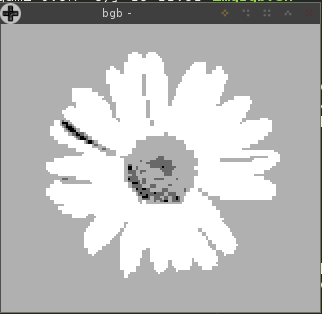
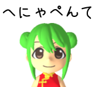
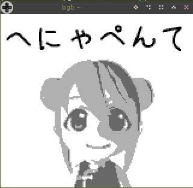

# img2gb.sh

渡された画像(解像度160x144)を、その画像を表示するゲームボーイのROMへ変換するシェルスクリプトです。

このような画像を、  


このように表示するゲームボーイのROMファイルへ変換します。  


実機でも動作確認済みです。


## 使い方

このリポジトリをクローンするか、ダウンロードし、
以下のようにコマンドを実行することで、ROMファイルを生成できます。

```shell
$ ./img2gb.sh 画像ファイル名 生成するROMファイル名
```

例)
```shell
$ ./img2gb.sh sample/daisy.png daisy.gb
```

※ 全てシェルスクリプトで作っているので時間がかかります。  
　 だいたい1分ほどお待ちください。(Intel Core i7 CPU @ 1.80GHzの環境にて)

## 動作環境

Debian GNU/Linux 9 (stretch) の環境で動作確認しています。

ただ、全てシェルスクリプトで作っており、`echo`や`dd`を駆使してゲームボーイのROMヘッダやLR35902(ゲームボーイのCPU)の機械語バイナリを生成しているので、`bash`が動くような環境ではどこでも動くかと思います。

ただ、画像の変換処理に`ImageMagick`の`convert`コマンドを使用していますので、無い場合はインストールしておいてください。

UbuntuやDebianなど、APTが使える環境の場合は以下のコマンドでインストールできます。

```shell
$ sudo apt install imagemagick
```

## 注意事項
### お遊び程度にご利用ください

シェルスクリプトで作ってみた程度のものなので、一応動作するものは生成しますが、  
同様のもっとちゃんとしたものはブラウザ上で使えるものがあったりします。

- GB イメージビューワーコンバーター
	- https://cubic-style.jp/gbiv/

ただ、ある意味シェルスクリプトでアセンブラも作っているようなものなので、  
ゲームボーイのROMの解析や、CPU命令の勉強の参考にはなるかもしれません。

### convertの減色処理は甘いです

この元画像が  


こんな風になったりします。  


`ImageMagick`を使用した画像変換は[tool/img22bpptiles.sh](tool/img22bpptiles.sh)で行っていますので、  
この中の`convert`コマンドの引数などを調整するともう少し良くなるかもしれません。

### カートリッジヘッダのGlobal Checksum(014E-014F)は未設定です

エミュレータによっては「ヘッダのチェックサムがおかしい」と警告などが出るかもしれませんが、無視して実行してください。

ROMのヘッダ情報の中の「Global Checksum(アドレス:014E-014F)」という領域が未設定であるためで、  
この領域は[実機で参照していない](http://bgb.bircd.org/pandocs.htm#thecartridgeheader)らしく、実際に未設定でも実機で動作しているため、  
簡単のために設定していません。
